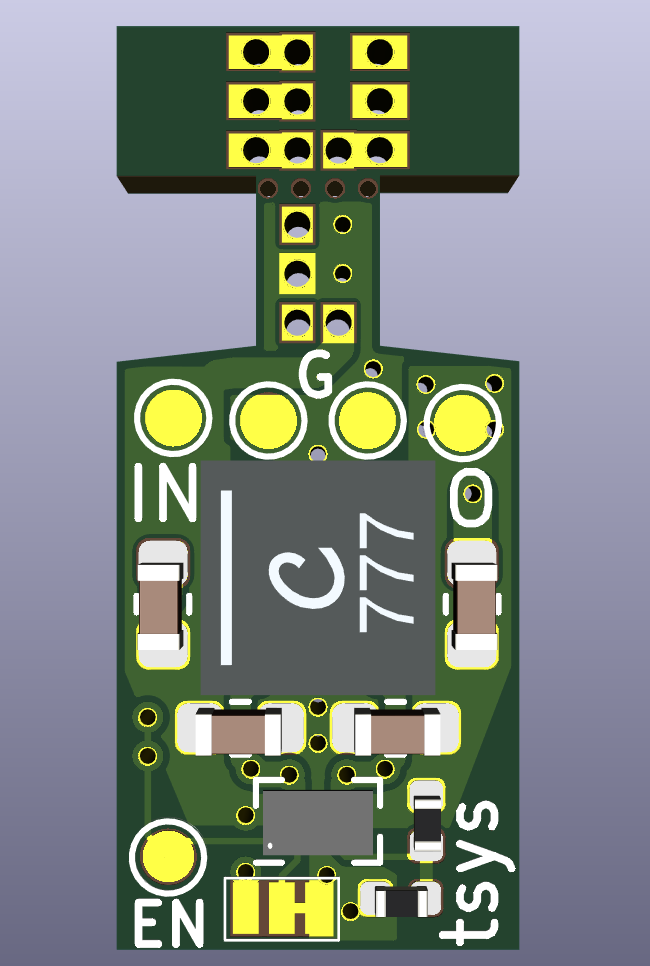
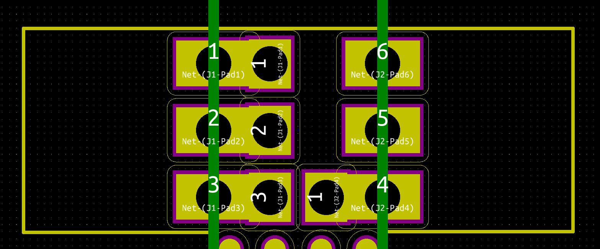

Pinebook Pro VCC3V3 regulator
=============================

This repo contains a small daughterboard for the Pinebook Pro. Contrary to the
buck-only regulator present on the V2.1 boards this one should be able to
keep VCC3V3_SYS at 3.3 V over the whole battery voltage range.

Build and use at your own risk. I've not tested this board yet.

# PCB

# Usage
The PCB consists of two parts: 

1. The adapter board
2. The regulator board

Both boards are conncted via mousebites for cheap manufacturing. The
adapter board is supposed to be snaped off the regulator board.
Then it needs to be prepared for usage:

1. Score the surface of the adapter board along the green lines 
2. Repeat from the backside
3. Break off the outher parts of the board (Yes, I'm too cheap for castelations :P)

Next the main board should be pupulated and soldered.
After that the adapter board can be soldered onto the main board.
Do not try soldering to the two vias in the upper right corner of the
regulator board. Do only solder the left column of throughholes and
the one in the lower right corner of the adapter board.
Next you should test if the board is functional. Connect ground one of the
two pads labeled with "G". Apply 2.5 to 5.5 V to the testpoint labeled with
"IN". You should see a voltage of 3.3 V at the testpoint labeled "O" once you
connect the testpoint labeled "EN" to "IN". The voltage should slowly vanish
when you connect "EN" to "G".

Next you will need to desolder U3 from the mainboard. (Remember to disconnect the battery!)
Once that is done you should be able to solder the adapter board with the attached regulator
board in its place. It needs to be oriented such that the regulator board rests on the two speaker
amplifiers. I'd recommend using some thin double-sided sticky tape to attach the board to the
aplifier chips. Optionally you can add some non-conductive foam on top of the regulator board so
it is held down by the bottom case, too.

All of the above SHOULD work. I've just though that up though and did not have a chance to actually test it yet.
So be warned. Everything above and/or in this repo might be totally wrong and blow up your device.
Also it may work just fine and give you stable PCIe below 3.3 V battery voltage. Enjoy.

